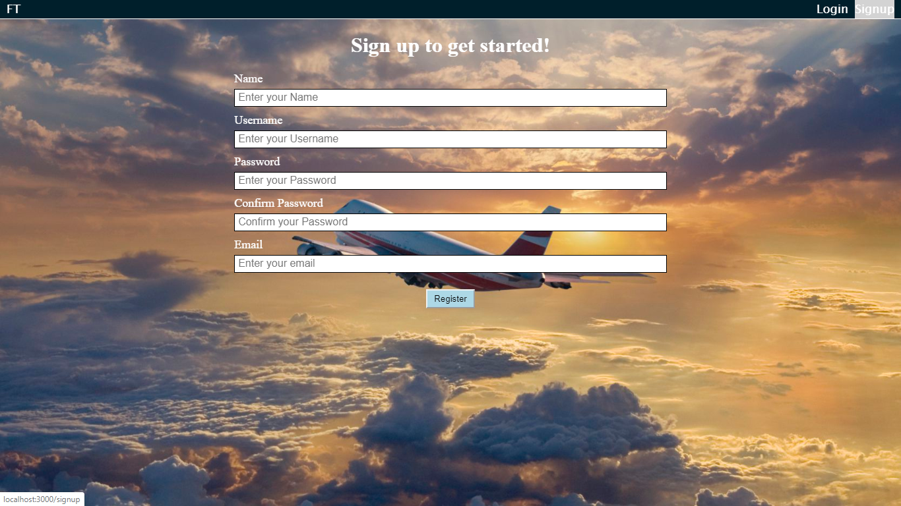
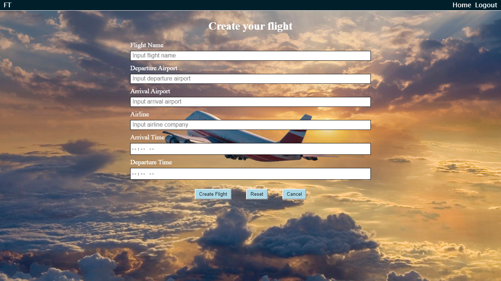

# FlightType

The live link to the app is https://flighttype-app.now.sh/

[FlightType Backend GitHub Repo](https://github.com/cmacdonald131/flightType-api.git)

## Screenshots

## About the App

This app was designed to help users keep track of their flight information, such as the arrival and departure times and airports.  The goal of the app is to allow a user to search for flights and save their information in one location so they don't have to check multiple sites for their flight information.

### Technology Used

This app was built using:
React,
CSS,
Node,
Express,
PostreSQL

